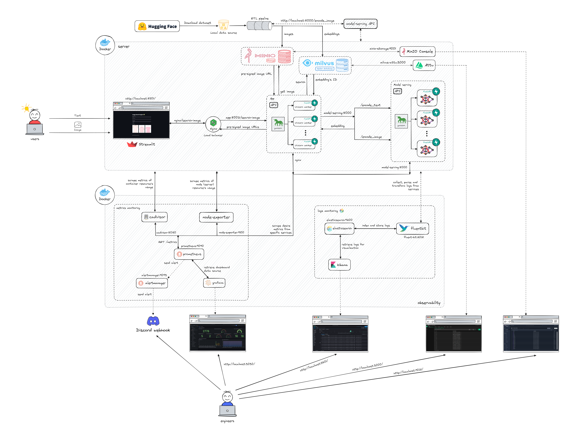
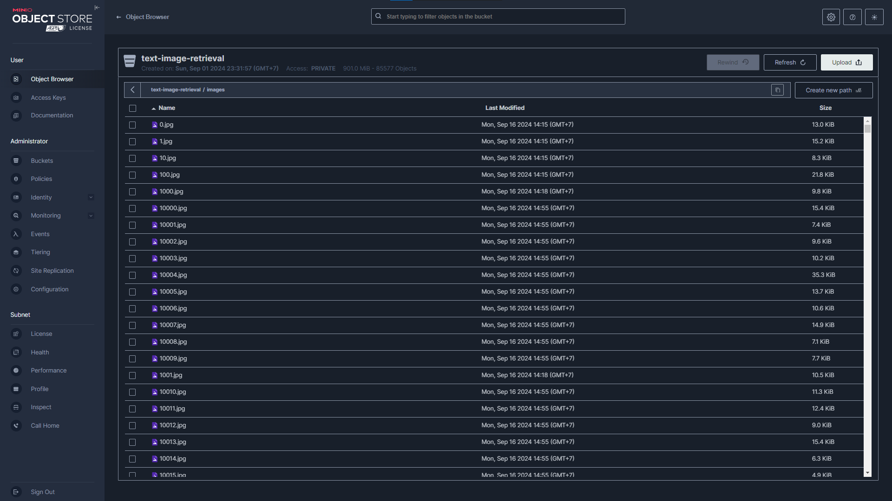
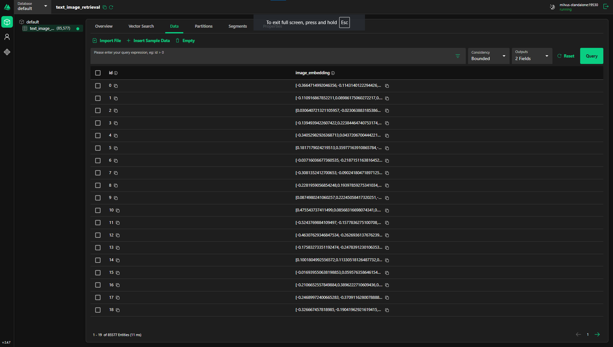
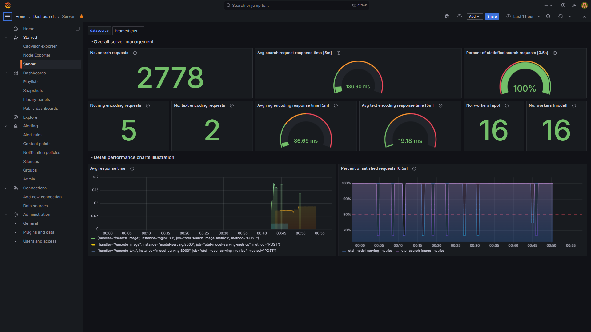
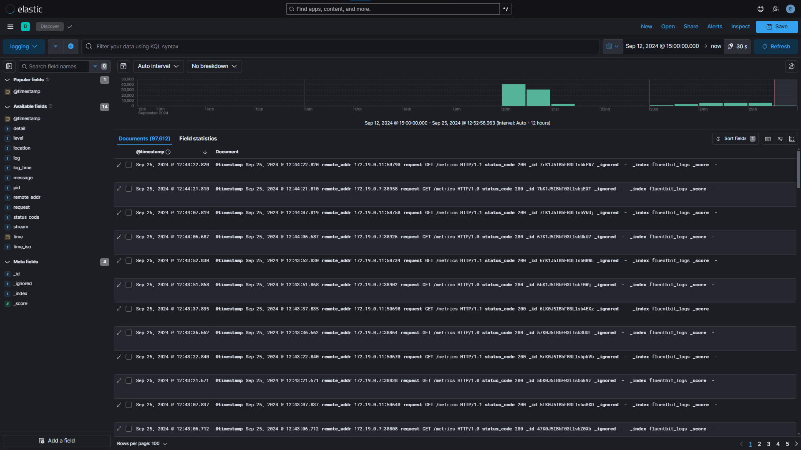

# Fashion Text-to-Image Retrieval System! 👗👜

Hi everyone 👋 Welcome to the official repository for our **Fashion Text-to-Image Retrieval System**! This system allows you to search for fashion-related images using either textual descriptions or image inputs. It's designed specifically to match fashion queries with relevant images, utilizing cutting-edge models for accurate retrieval.

Check out the demo below to see it in action:

<p align="center">
    <video width="1024" height="768" controls>
        <source src="./media_files/demo.mp4" type="video/mp4">
    </video>
</p>

<!-- {width=75%} -->

Here’s a look at the system architecture:

<p align="center">
  
</p>

The following steps will help you to get the system up and running:
- Go to `services` folder:
    ```bash
    cd services
    ```
- Create network for the whole system. This will create network `text_to_image_retrieval_network` and create an `.env` file for each service with the corresponding value of the network subnet:
    ```bash
    make create-network
    ```
- Setup folders for containers' volume:
    ```bash
    make setup-volumes
    ```
- Setup `.env` file for each service with value of all variables based on your system configuration design:
    ```bash
    # milvus/.env
    MINIO_ACCESS_KEY_ID=<MINIO_USERNAME>
    MINIO_SECRET_ACCESS_KEY=<SYSTEM_PASSWORD>
    MINIO_BUCKET_NAME=milvus-data
    NETWORK_SUBNET=<NETWORK_SUBNET>

    # minio/.env
    MINIO_ROOT_USER=<MINIO_USERNAME>
    MINIO_ROOT_PASSWORD=<SYSTEM_PASSWORD>
    NETWORK_SUBNET=<NETWORK_SUBNET>

    # etl/.env
    NO_PROXY_HOST=<SERVER_HOST>

    MILVUS_HOST=<SERVER_HOST>
    MILVUS_PORT=19530
    MILVUS_COLLECTION=text_to_image_retrieval
    MILVUS_METRIC_TYPE=COSINE
    MILVUS_INDEX_TYPE=HNSW

    MINIO_ENDPOINT=<SERVER_HOST>:9030
    MINIO_ACCESS_KEY_ID=<MINIO_USERNAME>
    MINIO_SECRET_ACCESS_KEY=<SYSTEM_PASSWORD>
    MINIO_BUCKET_NAME=text-to-image-retrieval

    MODEL_SERVING_HOST=<SERVER_HOST>
    MODEL_SERVING_PORT=8000

    # model_serving/.env
    ENTRY_PROXY=<SERVER_PROXY_IF_EXIST>
    NETWORK_SUBNET=<NETWORK_SUBNET>
    MODEL_ID=openai/clip-vit-base-patch32
    DEVICE=cuda

    # app/.env
    NO_PROXY_HOST=<SERVER_HOST>
    ENTRY_PROXY=<SERVER_PROXY_IF_EXIST>

    MILVUS_HOST=<SERVER_HOST>
    MILVUS_PORT=19530
    MILVUS_COLLECTION=text_to_image_retrieval
    MILVUS_METRIC_TYPE=COSINE
    MILVUS_INDEX_TYPE=HNSW

    MINIO_ENDPOINT=<SERVER_HOST>:9030
    MINIO_ACCESS_KEY_ID=<MINIO_USERNAME>
    MINIO_SECRET_ACCESS_KEY=<SYSTEM_PASSWORD>
    MINIO_BUCKET_NAME=text-to-image-retrieval

    MODEL_SERVING_HOST=<SERVER_HOST>
    MODEL_SERVING_PORT=8000

    NETWORK_SUBNET=<NETWORK_SUBNET>

    # streamlit/.env
    NO_PROXY_HOST=<SERVER_HOST>
    ENTRY_PROXY=<SERVER_PROXY_IF_EXIST>
    NETWORK_SUBNET=<NETWORK_SUBNET>

    # observability/.env
    NETWORK_SUBNET=<NETWORK_SUBNET>
    HTTPS_PROXY=<SERVER_PROXY_IF_EXIST>
    DISCORD_WEBHOOK_URL=<DISCORD_WEBHOOK_URL>
    ELASTIC_PASSWORD=<SYSTEM_PASSWORD>
    KIBANA_ENCRYPTION_KEY=Rr+p6ltpu1gkI4Sxu55qnfeY56KgbydIbmzngZfpBNA/
    GF_SECURITY_ADMIN_USER=<GAFANA_USERNAME>
    GF_SECURITY_ADMIN_PASSWORD=<SYSTEM_PASSWORD>
    ```
- You will get the folder structured like below:
    ```bash
    services
    ├── app
    │   ├── logs
    │   ├── nginx
    │   │   └── nginx.conf
    │   ├── prometheus_multiproc
    │   ├── app.py
    │   ├── docker-compose.yaml
    │   ├── Dockerfile
    │   ├── .env
    │   ├── gunicorn_conf.py
    │   ├── requirements.txt
    │   └── utils.py
    ├── etl
    │   ├── .env
    │   ├── jobs.py
    │   └── utils.py
    ├── milvus
    │   ├── .data
    │   │   ├── etcd
    │   │   └── milvus
    │   ├── docker-compose.yaml
    │   └── .env
    ├── minio
    │   ├── .data
    │   ├── docker-compose.yaml
    │   └── .env
    ├── model_serving
    │   ├── clip
    │   │   ├── logs
    │   │   ├── prometheus_multiproc
    │   │   ├── app.py
    │   │   ├── Dockerfile
    │   │   └── gunicorn_conf.py
    │   ├── embedder
    │   │   ├── logs
    │   │   ├── prometheus_multiproc
    │   │   ├── app.py
    │   │   ├── Dockerfile
    │   │   └── gunicorn_conf.py
    │   ├── llm
    │   │   ├── logs
    │   │   ├── prometheus_multiproc
    │   │   ├── app.py
    │   │   ├── Dockerfile
    │   │   └── gunicorn_conf.py
    │   ├── reranker
    │   │   ├── logs
    │   │   ├── prometheus_multiproc
    │   │   ├── app.py
    │   │   ├── Dockerfile
    │   │   └── gunicorn_conf.py
    │   ├── docker-compose.yaml
    │   ├── models.py
    │   └── requirements.txt
    ├── observability
    │   ├── config
    │   │   ├── alertmanager
    │   │   │   ├── alertmanager.yml
    │   │   │   ├── app.py
    │   │   │   ├── Dockerfile
    │   │   │   └── requirements.txt
    │   │   ├── elasticsearch
    │   │   │   ├── Dockerfile
    │   │   │   ├── elasticsearch.yml
    │   │   │   └── entrypoint.sh
    │   │   ├── fluentbit
    │   │   │   ├── fluent-bit.conf
    │   │   │   ├── parsers.conf
    │   │   │   └── time_format.lua
    │   │   ├── grafana
    │   │   │   ├── dashboards
    │   │   │   │   ├── Cadvisor exporter-1726634966300.json
    │   │   │   │   ├── Node Exporter-1726634989951.json
    │   │   │   │   └── Server-1726631892625.json
    │   │   │   ├── dashboards.yml
    │   │   │   └── datasources.yml
    │   │   ├── kibana
    │   │   │   └── kibana.yml
    │   │   └── prometheus
    │   │       ├── alert-rules.yml
    │   │       └── prometheus.yml
    │   ├── .data
    │   │   ├── alertmanager
    │   │   ├── elasticsearch
    │   │   ├── fluentbit
    │   │   ├── grafana
    │   │   └── prometheus
    │   ├── docker-compose.yaml
    │   └── .env
    ├── streamlit
    │   ├── app.py
    │   ├── docker-compose.yaml
    │   ├── Dockerfile
    │   ├── .env
    │   └── requirements.txt
    └── Makefile
    ```
- Setup all the base services, which includes storage, vector database, and model serving:
    ```bash
    make setup
    ```
- Next, download the dataset, which we will use in this project is [GLAMI-1M-test](https://huggingface.co/datasets/glami/glami-1m/resolve/main/GLAMI-1M-dataset--test-only.zip), which contains images of fashion products with item descriptions. The dataset is then processed to get the image embeddings and insert into the vector database **Milvus**. You can change to the dataset you want by changing the corresponding value of `--url` and `--folder_name` in target **load-dataset** of [Makefile](./services/Makefile) and modify the code of `ETL` class in [utils.py](./services/etl/utils.py) file to process the dataset based on its structure. You also need to modify the value of `--batch_size` based on your **GPU memory**, but the maximum batch size will be `1000`. Open another terminal and run the following command:
    ```bash
    make load-dataset
    ```
- Then, when all the base services are ready, we can now start the server:
    ```bash
    make up-server
    ```

- After that, we also need to start the observability servies to monitor and maintain the system if needed:
    ```bash
    make up-observability
    ```

- Finally, we'll run this command to check if all the containers are ready:
    ```bash
    docker ps
    ```
    You will get the following result, which means that the system is all setup:
    ```bash
    IMAGE                                            STATUS                             PORTS                                                                                      NAMES
    docker.elastic.co/kibana/kibana:8.15.1           Up 55 seconds                      0.0.0.0:5601->5601/tcp, :::5601->5601/tcp                                                  kibana
    fluent/fluent-bit:3.1.4-debug                    Up 55 seconds                      2020/tcp, 0.0.0.0:2021->2021/tcp, :::2021->2021/tcp                                        fluent-bit
    text-to-image-retrieval/alert-webhook            Up 55 seconds                      0.0.0.0:5000->5000/tcp, :::5000->5000/tcp                                                  alert-webhook
    text-to-image-retrieval/elasticsearch:8.15.1     Up 55 seconds (health)             0.0.0.0:9200->9200/tcp, :::9200->9200/tcp, 9300/tcp                                        elasticsearch
    prom/prometheus:latest                           Up 55 seconds                      0.0.0.0:9090->9090/tcp, :::9090->9090/tcp                                                  prometheus
    prom/node-exporter:latest                        Up 55 seconds                      0.0.0.0:9100->9100/tcp, :::9100->9100/tcp                                                  node-exporter
    grafana/grafana:latest                           Up 55 seconds (healthy)            0.0.0.0:3030->3000/tcp, :::3030->3000/tcp                                                  grafana
    gcr.io/cadvisor/cadvisor:latest                  Up 55 seconds (healthy)            0.0.0.0:8080->8080/tcp, :::8080->8080/tcp                                                  cadvisor
    prom/alertmanager:latest                         Up 55 seconds                      0.0.0.0:9093->9093/tcp, :::9093->9093/tcp                                                  alertmanager
    text-to-image-retrieval/streamlit                Up 40 seconds (healthy)            0.0.0.0:8501->8501/tcp, :::8501->8501/tcp                                                  streamlit
    nginx:latest                                     Up 40 seconds                      0.0.0.0:80->80/tcp, :::80->80/tcp                                                          nginx
    text-to-image-retrieval/app                      Up 40 seconds                      0.0.0.0:8008->8008/tcp, :::8008->8008/tcp                                                  app
    text-to-image-retrieval/model-serving/llm        Up 20 seconds                      8000/tcp, 0.0.0.0:8002->8002/tcp, :::8002->8002/tcp                                        model-serving-llm
    text-to-image-retrieval/model-serving/clip       Up 20 seconds                      0.0.0.0:8000->8000/tcp, :::8000->8000/tcp                                                  model-serving-clip
    text-to-image-retrieval/model-serving/embedder   Up 20 seconds                      8000/tcp, 0.0.0.0:8001->8001/tcp, :::8001->8001/tcp                                        model-serving-embedder
    text-to-image-retrieval/model-serving/reranker   Up 20 seconds                      8000/tcp, 0.0.0.0:8004->8004/tcp, :::8004->8004/tcp                                        model-serving-reranker
    zilliz/attu:v2.4.7                               Up 5 seconds                       0.0.0.0:3000->3000/tcp, :::3000->3000/tcp                                                  milvus-attu-container
    milvusdb/milvus:v2.4.9                           Up 5 seconds (healthy)             0.0.0.0:9091->9091/tcp, :::9091->9091/tcp, 0.0.0.0:19530->19530/tcp, :::19530->19530/tcp   milvus-standalone-container
    quay.io/coreos/etcd:v3.5.5                       Up 5 seconds (healthy)             2379-2380/tcp                                                                              milvus-etcd-container
    minio/minio:RELEASE.2024-08-29T01-40-52Z         Up 5 seconds (healthy)             0.0.0.0:9030->9000/tcp, :::9030->9000/tcp, 0.0.0.0:9031->9001/tcp, :::9031->9001/tcp       minio-storage-container
    ```
- You can access to the management console of these services:
    - Storage **MinIO**: `http://<HOST>:9021/`
    - Vector database **Milvus**: `http://<HOST>:3000/`
    - Model serving **FastAPI**: `http://<HOST>:8000/docs`
    - App **FastAPI**: `http://<HOST>/docs`
    - UI **Streamlit**: `http://<HOST>:8501/`
    - Metrics **Prometheus**: `http://<HOST>:9090/`
    - Metrics dashboard **Grafana** : `http://<HOST>:3030/`
    - Logs dashboard **Kibana** (username: **elastic**): `http://<HOST>:5601/app/discover#/`

- System visualization:

| MinIO Console                                                                                            | Attu Console (Milvus vector database)                                                         |
| :------------------------------------------------------------------------------------------------------: | :-------------------------------------------------------------------------------------------: |
|                  |      |

| Grafana Console (Metrics)                                                                                   | Kibana Console (Logs)                                                                                  |
| :---------------------------------------------------------------------------------------------------------: | :----------------------------------------------------------------------------------------------------: |
|  |  |
