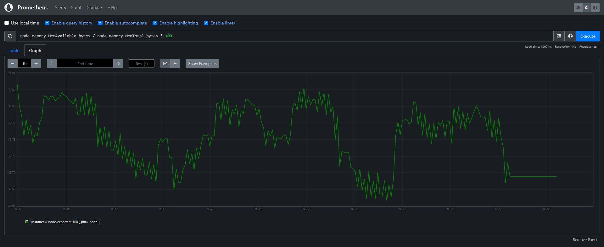

# Text-to-Image Retrieval System Documentation 📚👗👜

Welcome to the **Text-to-Image Retrieval System** documentation! This guide will walk you through everything you need to know about setting up, configuring, and running our system, designed specifically for fashion image searches.

The system allows you to input both text and images to find fashion-related images with precision. We’ve built the architecture using scalable services that are containerized and easy to deploy.

In this documentation, you will find:

- **System Overview**: An overview of how the system works and its architecture.
- **Service Setup**: Step-by-step instructions to set up all services using Docker Compose.
- **Configuration Guide**: How to configure environment variables and system parameters for smooth operation.
- **Usage Instructions**: Detailed instructions on how to interact with the system using text and image inputs.
- **Troubleshooting & Support**: Common issues and how to resolve them.

## System overview

Have a look at the overall system architecture:

<p align="left">
  
</p>

Our system is designed to run on a single node, with all services hosted using **Docker Compose**. The services communicate with each other via hostnames configured in the `docker-compose.yml` files. Services accessed by users or engineers are available through an external IP or the host server IP.

## System workflow

The system workflow is as follows:
1. Users input a query, which can be either a textual description or an image. If the input is text, it will be formatted as "A photo of **object**".
2. The input is then embedded by sending it to the **model-serving** service via the `/encode_text` or `/encode_image` API endpoints.
3. The resulting embedding is sent to the **vector database** to search for the top-k similar images. The response will be a list of k image IDs.
4. These IDs are used to retrieve the pre-signed URLs of the corresponding images from the **storage**.
5. The **frontend** displays these images to users using the retrieved URLs.

## System stages

The system can be divided into four stages:
1. [Setup Base Services](#setup-base-services): Initialize and configure the foundational services required for the system.
2. [Setup ETL Pipeline](#setup-ETL-pipeline): Prepare, transform, and load data sources using an ETL (Extract, Transform, Load) pipeline.
3. [Setup App Service and Interface](#setup-app-service-and-interface): Establish the main service and user interface for interacting with the system.
4. [Setup Observability](#setup-observability): Implement monitoring and logging to ensure the system's health and performance.

## Setup base services

In the initial stage of the system setup, we need to configure the storage and vector database services to store images and their embeddings. Additionally, we need to host the model-serving service to embed the images using the [CLIP](https://huggingface.co/openai/clip-vit-base-patch32) model from OpenAI.

All services in our system operate within the same bridge network, `$(NETWORK_NAME)`. To initialize this network, run the following command:

```sh
docker network create $(NETWORK_NAME)
```
Since our system uses a proxy, we need to ensure that all services can communicate without being blocked. To achieve this, configure the network subnet in all `.env` files, which are loaded by the **docker-compose.yml** files. This configuration will instruct the system to bypass the proxy for any addresses within that subnet. Additionally, when configuring each service's `docker-compose.yml` file, declare the hostnames of the specific services that need to connect in the `NO_PROXY` and `no_proxy` environment variables.

To simplify the setup process, we will use a [Makefile](../services/Makefile) to automatically execute all the necessary commands and scripts. This includes creating a script that inspects the previously created network and writes the network subnet value to the `.env` files of all services.

### 1. Storage - MinIO

This service consists of three components: storage and console. The **console** is used to monitor the storage. The [docker-compose.yml](../services/minio/docker-compose.yaml) file can be configured as follows:

  - Setup environment variables the root user authentication:
    ```yml
    MINIO_ROOT_USER: ${MINIO_ROOT_USER}
    MINIO_ROOT_PASSWORD: ${MINIO_ROOT_PASSWORD}
    ```

  - Allow the vector database Milvus or any addresses within the network subnet to bypass the proxy:
    ```yml
    NO_PROXY: localhost,milvus-etcd,milvus-standalone,${NETWORK_SUBNET}
    no_proxy: localhost,mulvus-etcd,milvus-standalone,${NETWORK_SUBNET}
    ```

  - Modify the ports for storage and console used in the container (default ports are `9000` and `9001`):
    ```yml
    ports:
      - "9030:9000"
      - "9031:9001"
    volumes:
        - ./.data:/data
    command: minio server /data --console-address ":9001"
    ```
      - `minio server /data`: This part of the command tells MinIO to start the server and use /minio_data as the directory for storing data.
      - `--console-address ":9001"`: This specifies that the MinIO console (web interface) should be accessible on port 9001.

  - Configure the service to run within the same network, which has already been initialized (`external: true`):
    ```yml
      networks:
        - text_to_image_retrieval_network

    networks:
      text_to_image_retrieval_network:
        name: text_to_image_retrieval_network
        external: true
    ```

You can now access the **MinIO Console** at <http://localhost:9021/> to monitor and manage all buckets created in MinIO. Use the root user credentials specified by the `MINIO_ROOT_USER` and `MINIO_ROOT_PASSWORD` environment variables.

### 2. Vector database - Milvus, Attu

This service consists of two components: the database and the console. The configuration for the **database** in [docker-compose.yml](../services/milvus/docker-compose.yaml) is based on the template provided by Milvus, which can be found [here](https://github.com/milvus-io/milvus/blob/master/deployments/docker/standalone/docker-compose.yml). For the **console**, we will use image `zilliz/attu`, which is an open-source management tool for Milvus.

- **`milvusdb/milvus`**: 

  Milvus uses two main ports for its operation:
  - `19530`: This is the primary port used for **client-server communication** in Milvus. 
  -  `9091`: This port is used for **exporting metrics** of each Milvus component, **health checks** of the Mivus service, access for **performance debugging**, and dynamic **log level management** via an HTTP interface. 
  ```yml
  ports:
    - "19530:19530"
    - "9091:9091"
  ```

  Set the addresses of MinIO and Milvus etcd services using their hostnames configured in [docker-compose.yml](../services/milvus/docker-compose.yaml):
  ```yml
  ETCD_ENDPOINTS: milvus-etcd:2379
  MINIO_ADDRESS: minio-storage:9000
  ```

  Configure Milvus to access MinIO and store its data in the specified bucket:
  ```yml
  MINIO_ACCESS_KEY_ID: ${MINIO_ACCESS_KEY_ID}
  MINIO_SECRET_ACCESS_KEY: ${MINIO_SECRET_ACCESS_KEY}
  MINIO_BUCKET_NAME: ${MINIO_BUCKET_NAME}
  ```

- **`zilliz/attu`**: 

  Sets the `MILVUS_URL` environment variable to your Milvus server's hostname and port:
  ```yml
  environment:
    MILVUS_URL: milvus-standalone:19530
  ```

  Ensure that the **Attu** service is only initialized after the Milvus server's health check succeeds:
  ```yml
  depends_on:
    milvus-standalone:
      condition: service_healthy
  ```

  You can set other optional environment variables when running the Attu container (access [here](https://github.com/zilliztech/attu/blob/main/README.md) for more details):
    - `DATABASE`: Default database name
    - `ATTU_LOG_LEVEL`: Sets the log level for Attu
    - `ROOT_CERT_PATH`, `PRIVATE_KEY_PATH`, `CERT_CHAIN_PATH`: SSL configuration
    - `SERVER_NAME`: Name of the host server
    - `SERVER_PORT`: Server listen port

  You can now access Attu Console at <http://localhost:3000/> to monitor and manage all the collections in the Milvus database without any authentication requirements.

### 3. Model-serving - FastAPI

We'll use FastAPI to serve the `CLIP` model, utilizing several `Uvicorn` workers managed by `Gunicorn` for multi-processing. Below are the key files and their purposes:
- **`model.py`**: Contains the `Encoder` class, which initializes the CLIP model and performs text/image embedding.
- **`app.py`**: The core file that handles all the main operations for incoming requests to the service.
- **`gunicorn_conf.py`**: The configuration file for Gunicorn.
- **`Dockerfile`**: Used to build the model-serving image.

For our **`Encoder`** class, you'll use the `transformers` package to load the CLIP model with ID `openai/clip-vit-base-patch32`. Below is the code snippet for initializing the model, processor, and tokenizer:
```python
from transformers import CLIPModel, CLIPProcessor, CLIPTokenizer

model = CLIPModel.from_pretrained("openai/clip-vit-base-patch32").to("cuda")
processor = CLIPProcessor.from_pretrained(model_id, clean_up_tokenization_spaces=True)
tokenizer = CLIPTokenizer.from_pretrained(model_id, clean_up_tokenization_spaces=True)
```
  - `CLIPModel`: Loads the pre-trained CLIP model.
  - `CLIPProcessor`: Prepares the inputs for the model, including tokenization and image - preprocessing.
  - `CLIPTokenizer`: Tokenizes the text inputs for the model.

The class will have 2 main function to embed text and images, which takes a list of images/text and returns their embeddings:
- For texts:
  ```python
  def get_text_embeddings(texts):
      text_inputs = tokenizer(texts, return_tensors = "pt", padding=True, truncation=True).to("cuda")
      text_embeddings = model.get_text_features(**text_inputs)

      # convert the embeddings to list 
      return text_embeddings.cpu().detach().numpy().tolist()
  ```

- For images:
  ```python
  def get_image_embeddings(images):
    image_inputs = processor(
        text = None,
        images = images, 
        return_tensors="pt",
        padding=True
    )["pixel_values"].to("cuda")
    embeddings = model.get_image_features(image_inputs)

    # convert the embeddings to list
    return embeddings.cpu().detach().numpy().tolist()
  ```

After performing any embedding, it is essential to free up the memory to avoid memory leaks:
```python
del text_inputs
del image_inputs
del embeddings

torch.cuda.empty_cache()
```

Now, let's move on to the main file **`app.py`**. We'll need an initialization function to load the model when the FastAPI application starts:
```python
@asynccontextmanager
async def lifespan(app: FastAPI):
  # Loading model
  encoder = Encoder(model_id=model_id, device=device)
  # Clean up the model
  yield
  del encoder

app = FastAPI(lifespan=lifespan)
```
  - `@asynccontextmanager`: This decorator is used to define an asynchronous context manager. It allows you to write setup and teardown code around a block of code.
  - `yield`: The code after `yield` runs when the application shuts down.

There are two main functions to handle 2 endpoints for encoding text and images:
  - `/encode_text`:

    ```python
    @app.post("/encode_text")
    async def encode_text(request: Request, texts: List[str]):
        try:
            embeddings = encoder.get_text_embeddings(texts)
            return {"embeddings": embeddings}
        except Exception as e:
            raise HTTPException(status_code=500, detail="Internal Server Error")
    ```

  - `/encode_image`:

    ```python
    @app.post("/encode_image")
    async def encode_image(request: Request, files: List[UploadFile] = File(...)):
        try:
            images = [Image.open(io.BytesIO(await file.read())).convert("RGB") for file in files]
            embeddings = encoder.get_image_embeddings(images)
            return {"embeddings": embeddings}
        except Exception as e:
            raise HTTPException(status_code=500, detail="Internal Server Error")
    ```

As mentioned above, you'll use `Gunicorn` to manage multi `Uvicorn` workers running FastAPI application, so it is essential to setup `gunicorn_conf.py` file:

```python
# Worker Options
workers = 16
worker_class = "uvicorn.workers.UvicornWorker"

# Worker timeout
timeout = 120
```
  - `workers`: Specifies the number of worker processes for handling requests. The number of workers can be determined based on the number of CPU cores available. A common formula is `(2 x $num_cores) + 1`.
  - `worker_class`: Specifies the type of worker to use. We use `"uvicorn.workers.UvicornWorker"` to run Uvicorn workers.
  - `timeout`: Specifies the maximum number of seconds a worker can take to handle a request before it is killed and restarted.

To run the FastAPI application with Gunicorn using the configuration file, use the following command:
```sh
gunicorn -c gunicorn_conf.py app:app
```

Ensure that your service directory looks something like this:
```
model-serving/
│
├── gunicorn_conf.py
├── app.py
└── ...
```

Now, you'll build **Docker image** for the model-serving and run it with **Docker Compose**. Below is the `Dockerfile`:
```Dockerfile
FROM python:3.9-slim

ARG ENTRY_PROXY

WORKDIR /app

COPY requirements.txt .

RUN apt-get update -o Acquire::http::Proxy="${ENTRY_PROXY}" && \
    apt-get install -y --no-install-recommends iputils-ping -o Acquire::http::Proxy="${ENTRY_PROXY}" && \
    apt-get clean

RUN pip install -r requirements.txt --proxy="${ENTRY_PROXY}" --no-cache-dir
```
  - `ENTRY_PROXY`: Since our server has a proxy, we need to add the proxy to install packages and dependencies. The `ENTRY_PROXY` argument allows us to specify the proxy server URL during the build process. This ensures that all `apt-get` and `pip` commands use the specified proxy to download and install the necessary packages and dependencies. If your server does not have a proxy, you can adjust the `Dockerfile` by removing the proxy-related configurations:
    - Removed `ARG ENTRY_PROXY`.
    - Updated `RUN` Commands: Removed the proxy options `-o Acquire::http::Proxy="${ENTRY_PROXY}"` and `--proxy="${ENTRY_PROXY}"`.

Add the command mentioned above to run Gunicorn server with the specified configuration and appplication.
```yml
command: gunicorn -c gunicorn_conf.py app:app
```

## Setup ETL pipeline

To streamline management, we will organize the ETL pipeline into two main files:

- `utils.py`: This file contains all the necessary classes and functions for downloading, extracting, and transforming the dataset into images and corresponding embeddings. It also includes methods for loading the processed data into storage and a vector database.
- `jobs.py`: This file handles the workflow of the ETL pipeline, orchestrating the various steps defined in `utils.py`.

In **`utils.py`**, we define four main classes:

  - **`Dataset`**: Responsible for downloading and unzipping the dataset.
  - **`EncoderClient`**: Responsible for making requests to the model-serving service to embed text and images.
  - **`VectorDatabase`**: Responsible for connecting to the Milvus server, creating collections for storing embeddings, loading collections for initialization, and performing operations like inserting, getting, and searching embedding vectors.
  - **`ETL`**: Responsible for extracting the dataset, transforming it into embeddings, and loading them into the vector database.

In **`jobs.py`**, the workflow is divided into two main stages:

  - **Initialize Services**: Set up all the required services, including the encoder client, vector database client, and MinIO client.

    ```python
    encoder = EncoderClient(
        host=os.getenv('MODEL_SERVING_HOST'),
        port=os.getenv('MODEL_SERVING_PORT'),
    )

    milvus_client = VectorDatabase(
        host=os.getenv('MILVUS_HOST'),
        port=os.getenv('MILVUS_PORT')
    )

    minio_client = Minio(
        endpoint=os.getenv('MINIO_ENDPOINT'),
        access_key=os.getenv('MINIO_ACCESS_KEY_ID'),
        secret_key=os.getenv('MINIO_SECRET_ACCESS_KEY'),
        secure=False
    )
    ```

  - **Start the Pipeline**: Execute the ETL process, which will either download the dataset to a local folder or perform the full ETL process, depending on the user's choice.

For more details, you can refer to the [utils.py](../services/etl/utils.py) and [jobs.py](../services/etl/jobs.py) files.

## Setup app service and interface

### 1. App - FastAPI

The `app` service acts as the **backend server** of the system, managing and handling all the main operations for incoming image search requests. It listens to all requests at the **POST** endpoint `/search-image`, sends requests to the model-serving service at the **POST** endpoints `/encode_text` or `/encode_image` to embed the text/image input, searches for the top-k similar embeddings to the query embedding in the Milvus vector database, retrieves the **pre-signed URLs** of the corresponding images from MinIO storage, and returns the response.

To set up the `app` service, you'll follow a similar process as for the model-serving service, but we will add the `Nginx` service, which works as a **reverse proxy**, forwarding client requests to the Gunicorn server running the FastAPI application. This helps in **load balancing** and **distributing** incoming traffic **across multiple Gunicorn workers**.

`Gunicorn` is responsible for **managing multiple Uvicorn workers within a single node**, effectively handling concurrent requests by distributing them among these workers. Each Uvicorn worker runs an instance of the FastAPI application, allowing Gunicorn to scale the application horizontally within the node. On the other hand, `Nginx` operates at a higher level, **managing multiple Gunicorn instances across different nodes**. This means that Nginx can distribute incoming traffic not just among the workers within a single node, but across multiple nodes running Gunicorn, providing an additional layer of load balancing and fault tolerance. By **using Nginx in conjunction with Gunicorn**, we can achieve a robust and scalable architecture that efficiently **handles high traffic loads and ensures high availability**.

Below is the configuration of the `Nginx` service in the `nginx.conf` file:

```conf
server {
    listen 80;
    server_name localhost;

    location / {
        proxy_pass http://app:8002;
        proxy_set_header Host $host;
        proxy_set_header X-Real-IP $remote_addr;
        proxy_set_header X-Forwarded-For $proxy_add_x_forwarded_for;
        proxy_set_header X-Forwarded-Proto $scheme;
    }

    access_log /var/log/nginx/access.log;
    error_log /var/log/nginx/error.log;
}
```
  - `server { ... }`: Defines a server block that contains configuration for handling incoming requests.
  - `listen 80`: Configures Nginx to listen on port 80 for incoming HTTP requests.
  - `server_name localhost`: Specifies the server name.
  - `location / { ... }`: Defines a location block that matches all requests to the root URL (`/`).
    - `proxy_pass http://app:8002`: Forwards incoming requests to the FastAPI application running on Gunicorn, which is accessible at <http://app:8002>.
    - `proxy_set_header Host $host`: Sets the Host header in the forwarded request to the value of the `$host` variable.
    - `proxy_set_header X-Real-IP $remote_addr`: Sets the `X-Real-IP` header to the client's IP address.
    - `proxy_set_header X-Forwarded-For $proxy_add_x_forwarded_for`: Sets the `X-Forwarded-For` header to include the client's IP address and any forwarded IP addresses.
    - `proxy_set_header X-Forwarded-Proto $scheme`: Sets the `X-Forwarded-Proto` header to the scheme (`http` or `https`) used by the client.

### 2. User interface - Streamlit

The `Streamlit` service acts as the frontend of the application, allowing users to send requests to the backend. The main file to set up is the `app.py` file:

Since the `Streamlit` service is the only service that users interact with directly through the external IP or the host server IP (not the address used in the container), we need to configure the `NO_PROXY` environment variable. This tells the service not to check the proxy when sending requests to the `app` service without using the hostname set up in the [docker-compose.yaml](../services/app/docker-compose.yaml) file.

  ```python
  os.environ["NO_PROXY"] = host

  API_URL = f"http://{host}/search-image"
  ```

- When users input a text query, the application checks whether the query contains the word `photo`. If not, the query is reformatted to `"a photo of {object}"`:

  ```python
  if "photo" not in query.lower():
      prompted_query = f"a photo of {query}."
  else:
      prompted_query = query
  ```

- The result images are displayed in rows with a maximum of 3 images per row, instead of a single image per row. This improves the visual presentation and makes better use of the available space:

  ```python
  def display_images_in_rows(image_urls, images_per_row=3):
    for i in range(0, len(image_urls), images_per_row):
        cols = st.columns(images_per_row)
        for j, col in enumerate(cols):
            if i + j < len(image_urls):
                col.image(image_urls[i + j])
  ```

For detailed instructions on how to write the `Dockerfile` and `docker-compose.yaml` files, please refer to the following files: [Dockerfile](../services/streamlit/Dockerfile) and [docker-compose.yaml](../services/streamlit/docker-compose.yaml).

By following these steps, we ensure that the Streamlit service is properly configured to interact with the backend, format user queries appropriately, and display results in a user-friendly manner. 

## Setup observability

`Observability` is a critical aspect of modern application management, enabling you to monitor, troubleshoot, and optimize your system effectively. By implementing observability, you gain insights into the internal state of your application through the collection and analysis of `metrics`, `logs`, and `traces`. This helps in identifying performance bottlenecks, detecting anomalies, and ensuring the reliability and availability of your services.

In this section, we will set up observability for our system using a combination of tools for metrics and logs:

### 1. Metrics - Prometheus, Cadvisor, Node-exporter, Alertmanager, Grafana

`Metrics` provide quantitative data about the performance and health of your application. They help you **understand how your system is behaving over time** and can be used to **set up alerts for abnormal behavior**. We will use the following tools to collect, store, and visualize metrics:

- **Prometheus**: An open-source systems monitoring and alerting toolkit that collects and stores metrics as time series data.
- **Cadvisor**: A container advisor that provides insights into resource usage and performance data from running containers.
- **Node-exporter**: A Prometheus exporter for hardware and OS metrics, providing detailed information about the system's health.
- **Alertmanager**: A tool to handle alerts sent by Prometheus, allowing you to define alerting rules and manage notifications.
- **Grafana**: An open-source platform for monitoring and observability that provides powerful visualization capabilities for your metrics data.

For our system, we will monitor metrics related to resource usage of the running containers and the server, as well as the performance of the `app` and `model-serving` services. To achieve this, we need to configure these services to export metrics data to the **GET** endpoint `/metrics`.

To use `Prometheus` with `FastAPI` and `Gunicorn`, we will use the [Prometheus Python Client](https://prometheus.github.io/client_python/exporting/http/fastapi-gunicorn/) and [Prometheus FastAPI Instrumentator](https://github.com/trallnag/prometheus-fastapi-instrumentator?tab=readme-ov-file) libraries. The `prometheus_fastapi_instrumentator` module will instrument the FastAPI application, automatically collect metrics, and export them to Prometheus. However, since both services are running in **multi-processing** mode with multiple Uvicorn workers, our `app.py` file will be configured as follows:

```python
from prometheus_client import make_asgi_app

app = FastAPI(debug=False)

# Using multiprocess collector for registry
def make_metrics_app():
    registry = CollectorRegistry()
    multiprocess.MultiProcessCollector(registry)
    return make_asgi_app(registry=registry)

app.mount("/metrics", make_metrics_app())
```

Additionally, the `gunicorn_conf.py` file needs to include the following function to handle worker processes:

```python
from prometheus_client import multiprocess

def child_exit(server, worker):
    multiprocess.mark_process_dead(worker.pid)
```

To collect customized metrics data, `prometheus_client` provides four main types of metrics: `Counter`, `Gauge`, `Summary`, and `Historgram`. Refer to the documentation on [Instrumenting](https://prometheus.github.io/client_python/instrumenting/) for more details. For example, in `model-serving` service, to collect metrics about `number of encoding requests`, we can use the `Counter` type:

```python
from prometheus_client import Counter

counter = Counter("encoding_requests", "Number of encoding requests", ("method", "endpoint"))

@app.post("/encode_text")
async def encode_text(request: Request, texts: List[str]):
    try:
        embeddings = encoder.get_text_embeddings(texts)

        counter.labels(method="post", endpoint="/encode_text").inc()

        return {"embeddings": embeddings}
    except Exception as e:
        raise HTTPException(status_code=500, detail="Internal Server Error")
```

To monitor the `number of active workers`, we will use the `Gauge` type. However, since the application is running in **multi-processing** mode, the `multiprocess_mode` needs to be configured correctly for the `Gauge` type to collect metrics accurately. The `gunicorn_conf.py` file will be updated as follows:

```python
from prometheus_client import Gauge

worker_gauge = Gauge("model_serving_active_workers", "Number of active workers in model-serving service", multiprocess_mode="livesum")

def post_worker_init(worker):
    """Increment the number of workers when a new worker is initialized."""
    worker_gauge.inc()

def worker_exit(server, worker):
    """Decrement the number of workers when a worker exits."""
    worker_gauge.dec()
```
  - To collect the number of active workers, we use the `livesum` mode, which sums the values of all processes (considering only living processes). Refer to [Metrics tuning (Gauge)](https://prometheus.github.io/client_python/multiprocess/) for more details.

Next, to configure `Node Exporter` and `Cadvisor` to collect and export metrics for resource usage of the servers and running containers to Prometheus, we need to define them in the [docker-compose.yaml](../services/observability/docker-compose.yaml) file. You can refer to the [node-exporter config](https://grafana.com/docs/grafana-cloud/send-data/metrics/metrics-prometheus/prometheus-config-examples/docker-compose-linux/) and [cadvisor config](https://prometheus.io/docs/guides/cadvisor/) for detailed configuration examples.

To set up the `Prometheus` service, we also need to define it in the [docker-compose.yaml](../services/observability/docker-compose.yaml) file, based on the configuration examples provided [here](https://grafana.com/docs/grafana-cloud/send-data/metrics/metrics-prometheus/prometheus-config-examples/docker-compose-linux/). Additionally, we need to configure `Prometheus` to scrape metrics from the desired services in the [prometheus.yml](../services/observability/config/prometheus/prometheus.yml) file. For example, to scrape metrics from the `node-exporter` service, you would add the following configuration:

```yml
global:
  scrape_interval: 15s

scrape_configs:
  - job_name: 'node'
    static_configs:
      - targets: ['node-exporter:9100']
```
  - `scrape_interval`: Sets the interval at which Prometheus will scrape metrics from the configured targets.
  - `job_name`: Specifies the name of the scrape job. This name is used to identify the job in Prometheus.
  - `targets`: Specifies the targets from which Prometheus should scrape metrics. The format is usually `<service-hostname/service-ip-address>:port`. In this case, for the `Node Exporter` service, it will be `node-exporter:9100`.

After setting up and running the services, you can access the metrics exported by each service by navigating to <http://localhost:{port}/metrics>, replacing `{port}` with the appropriate port number for each service.

To get alerts when one of the metrics exceeds the acceptable threshold, we need to add `Alertmanager` service. The `docker-compose.yaml` file can be configured based on this [Dockerfile](https://github.com/prometheus/alertmanager/blob/main/Dockerfile) file example:

  ```yaml
  volumes:
    - ./config/alertmanager/alertmanager.yml:/etc/alertmanager/alertmanager.yml
    - ./.data/alertmanager:/alertmanager
  command:
    - '--config.file=/etc/alertmanager/alertmanager.yml'
    - '--storage.path=/alertmanager'
  ```
  - Specify directory of configuration file `alertmanager.yml` inside the container using `--config.file`.
  - Specify the storage path of Alertmanager inside the container using `--storage.path`.

To configure the `Alertmanager` service, we need to define the `receiver` through which it can send notifications when an alert is firing. `Alertmanager` supports various types of receivers such as `email`, `discord`, `webhook`, `pagerduty`, `slack`, etc. You can find the list of receivers and their configurations [here](https://prometheus.io/docs/alerting/latest/configuration/).

For our system, we will send notifications to a **Discord webhook**. However, our server blocks connections to external IP addresses when using **low-level tools** like `curl`, `ping`, `smtp`, etc. Therefore, we will configure it to send notifications to a `webhook` receiver via a high-level library like `requests`. This requires deploying a **webhook sender** using `FastAPI` as the `alert-webhook` service. The `app.py` file for the `alert-webhook` service will have two main functions. You can refer to the detailed code in the [app.py](../services/observability/config/alertmanager/app.py) file.

```python
webhook_url = os.getenv("DISCORD_WEBHOOK_URL")

@app.post("/alert")
async def alert(request: Request):
    data = await request.json()
    send_alert_to_discord(data)
    return {"message": "Alert received"}

def send_alert_to_discord(alert_data):

    # Transform `alert_data` into `message` with correct format..
    # Code here...
    
    payload = {
        "content": message
    }
    
    headers = {
        "Content-Type": "application/json"
    }
    
    response = requests.post(webhook_url, json=payload, headers=headers)
    if response.status_code != 204:
        print(f"Failed to send alert to Discord: {response.status_code}, {response.text}")

if __name__ == '__main__':
    uvicorn.run(app, host='0.0.0.0', port=5000, reload=False)
```

Next, we need to write the configuration file `alertmanager.yml` to send notifications to the `alert-webhook` service. The `alert-webhook` service will listen on port `5000` at the endpoint `/alert`:

```yml
global:
  resolve_timeout: 5m

route:
  receiver: webhook
  repeat_interval: 15s

receivers:
  - name: webhook
    webhook_configs:
      - url: 'http://alert-webhook:5000/alert'
```

Now we just need to define the alert rules in `alert-rules.yml` and configure the `prometheus.yml` file to specify Prometheus's Alertmanager configuration and which rule files it will use:

- `alert-rules.yml` (refer to the [alert-rules.yml](../services/observability/config/prometheus/alert-rules.yml) file for more details):

  ```yml
  groups:
  - name: Server alerts
    rules:
    - alert: NodeOutOfMemory
      expr: node_memory_MemAvailable_bytes / node_memory_MemTotal_bytes * 100 < 10
      for: 30s
      labels:
        severity: critical
      annotations:
        summary: "Instance {{ $labels.instance }} is out of memory"
        description: "{{ $labels.instance }} has less than 10% memory available which is currently {{ humanize $value }}"

  - name: Container alerts
    rules:
    - alert: ContainerHighMemoryUsage
      expr: sum(container_memory_usage_bytes) / sum(container_spec_memory_limit_bytes) * 100 > 80
      for: 30s
      labels:
        severity: critical
      annotations:
        summary: "Container {{ $labels.container_name }} is out of memory"
        description: "{{ $labels.container_name }} has more than 80% memory usage which is currently {{ humanize $value }}%"

  - name: Service alerts
    rules:
    - alert: SearchRequestHighLatency
      expr: rate(http_request_duration_seconds_sum{handler="/search-image", method="POST"}[5m]) /rate(http_request_duration_seconds_count{handler="/search-image", method="POST"}[5m]) > 0.5
      for: 30s
      labels:
        severity: warning
      annotations:
        summary: "Search service has high request latency"
        description: "Search service has high request latency which is currently {{ humanize $value }}s"
  ```
  - `expr`: Use the **PromQL expression** to evaluate the alert condition. You can check whether if the expression is in correct format at <http://localhost:9090/graph>.
  - `for`: Causes Prometheus to wait for a certain duration between first encountering a new expression output vector element and counting an alert as firing for the element.
  - `labels`: Specifies a set of additional labels to be attached to the alert.
  - `description`: A detailed description of the alert. The `{{ humanize $value }}` is used to format the value of the expression in a human-readable form. The `instance` part in `{{ $labels.instance }}` or `container_name` in `{{ $labels.container_name }}` can be found in legend lists of the graph shown for the expression used in `expr` at <http://localhost:9090/graph>.

    

- `prometheus.yml` (refer to the [prometheus.yml](../services/observability/config/prometheus/prometheus.yml) file for more details):

  ```yml
  global:
    evaluation_interval: 15s

  alerting:
    alertmanagers:
      - static_configs:
          - targets: ['alertmanager:9093']

  rule_files:
    - 'alert-rules.yml'
  ```
  - `evaluation_interval`: Defines the intervals at which the rules are evaluated.
  - `targets`: Specifies the target Alertmanager instance. We can replace `alertmanager` with the IP address of the server host.
  - `rule_files`: Specifies the files containing alerting rules that Prometheus should load.

Eventually, to visualize all the metrics from the `Prometheus` data source in **dashboards**, we need to add the `Grafana` service. The `docker-compose.yml` file can be configured based on the [bind-mount example](https://grafana.com/docs/grafana/latest/setup-grafana/installation/docker/#example-1) and the [Grafana Configuration documentation](https://grafana.com/docs/grafana/latest/setup-grafana/configure-grafana/). The two main configuration files needed are:
  - **`datasources.yml`**: Specifies the data sources that `Grafana` will use to fetch metrics. Refer to [Data Source Graphite Example](https://grafana.com/docs/grafana/latest/administration/provisioning/#example-data-source-configuration-file) for more details.

    ```yml
    apiVersion: 1

    # list of datasources that should be deleted from the database
    deleteDatasources:
      - name: Prometheus
        orgId: 1

    #  list of datasources to insert or update in the database
    datasources:
      - name: Prometheus
        type: prometheus
        access: proxy
        url: http://prometheus:9090
        isDefault: true
        editable: true
    ```

  - **`dashboards.yml`**: Specifies the directory containing all of the dashboard files on disk inside the container. This configuration allows `Grafana` to automatically load and manage dashboards from the local filesystem. Refer to [Dashboards Documentation](https://grafana.com/docs/grafana/latest/administration/provisioning/#dashboards) for more details.

    ```yml
    apiVersion: 1

    providers:
      # <string> an unique provider name. Required
      - name: 'MyProvider'
        # <int> Org id. Default to 1
        orgId: 1
        # <string> name of the dashboard folder.
        folder: ""
        # <string> folder UID. will be automatically generated if not specified
        folderUid: ""
        # <string> provider type. Default to 'file'
        type: file
        # <bool> disable dashboard deletion
        disableDeletion: true
        # <int> how often Grafana will scan for changed dashboards
        updateIntervalSeconds: 10
        # <bool> enable/disable dashboard search
        editable: true
        # <bool> allow updating provisioned dashboards from the UI
        allowUiUpdates: true
        options:
          # <string, required> path to dashboard files on disk. Required when using the 'file' type
          path: /opt/grafana/dashboards
          # <bool> use folder names from filesystem to create folders in Grafana
          foldersFromFilesStructure: true      
    ```
    - `path`: The path to the dashboard files on disk. Modify this to the path where your dashboard files are stored inside the container. If you adjust the `path` here, make sure to also update the corresponding volume mount in the [docker-compse.yml](../services/observability/docker-compose.yaml) file to ensure the correct directory is mapped.

After configuring these settings, you can access `Grafana` at <http://localhost:3030/dashboards> using the authentication credentials (`GF_SECURITY_ADMIN_USER` and `GF_SECURITY_ADMIN_PASSWORD`) specified in the `docker-compose.yaml` file to monitor the metrics collected from the `app` and `model-serving` services.

### 2. Logs - Fluentbit, Elasticsearch, Kibana

`Logs` provide **a detailed record of events** that occur within your application. They are essential for debugging and understanding the flow of execution. We will use the following tools to collect, store, and analyze logs:

- **Fluentbit**: A lightweight and high-performance log processor and forwarder that collects logs from various sources and forwards them to a central location, which in this system is Elasticsearch.
- **Elasticsearch**: A distributed, RESTful search and analytics engine that stores and indexes logs, making them searchable and analyzable.
- **Kibana**: An open-source data visualization dashboard for Elasticsearch, allowing you to explore and visualize your logs in real-time.

Our system is designed to monitor logs from two primary services: `app` and `model-serving`. To achieve this, we first need to add logging capabilities to these two services by updating the `app.py`, `gunicorn_conf.py`, and `docker-compose.yml` files:

- `app.py`:

  ```python
  from loguru import logger

  # Remove all handlers associated with the root logger object
  logger.remove()
  # Configure the logger
  logger.add(
      "./logs/process.log",
      rotation="5 GiB",
      format="{time:YYYY-MM-DDTHH:mm:ss.SSSZ} | {level} | {name}:{function}:{line} - {message}"
  )

  @app.post("/encode_text")
  async def encode_text(request: Request, texts: List[str]):
      """Encode the given batch of texts."""
      logger.info(f"Received texts to encode: {texts}")
      try:
          embeddings = encoder.get_text_embeddings(texts)
          return {"embeddings": embeddings}
      except Exception as e:
          logger.error(f"Error encoding texts: {e}")
          raise HTTPException(status_code=500, detail="Internal Server Error")
  ```

- `gunicorn_conf.py`:

  ```python
  # Log level
  loglevel = "info"

  # Access log
  accesslog = "./logs/access.log"
  errorlog = "./logs/error.log"
  ```

- `docker-compose.yml`:

  ```yml
  volumes:
    - ./logs:/app/logs
  ```

Next, we need to set up the `Fluent Bit` service to collect and parse the logs. The configuration of the [docker-compose.yml](../services/observability/docker-compose.yaml) file is based on the [Docker Compose Example](https://docs.fluentbit.io/manual/local-testing/logging-pipeline#docker-compose). To enable `Fluent Bit` to collect logs from the `app` and `model-serving` services, we need to mount the volume to the `logs` folder:

  ```yaml
  volumes:
    - ./config/fluentbit/fluent-bit.conf:/fluent-bit/etc/fluent-bit.conf
    - ./../app/logs:/app/logs:ro
    - ./../model_serving/logs:/model_serving/logs:ro
  ```

There are two main configuration files need to setup:

- **`parsers.conf`**: This file defines the parsers that `Fluent Bit` will use to interpret and structure the log data. We will use two types of parsers:
  - **`PARSER`**: This parser is used to define the format of single-line log entries. It helps in extracting structured data from log lines based on a specified pattern. Refer to [Configuring Parser](https://docs.fluentbit.io/manual/pipeline/parsers/configuring-parser) and [Parser Example](https://github.com/fluent/fluent-bit/blob/master/conf/parsers.conf) for more details.

    ```bash
    [PARSER]
      Name                error_log_detail
      Format              regex
      Regex               /^\[(?<time>\d{4}-\d{2}-\d{2} \d{2}:\d{2}:\d{2}) [+-]\d{4}\] \[(?<pid>\d+)\] \[(?<level>[^\]]+)\] (?<detail>.*)$/m
      Time_Key            time
      Time_Format         %Y-%m-%d %H:%M:%S
      Time_Keep           On
    ```

  - **`MULTILINE_PARSER`**: This parser is used to handle multi-line log entries, such as stack traces or logs that span multiple lines. It ensures that these multi-line logs are treated as a single log entry stored as the value for key `log`.

    ```bash
    [MULTILINE_PARSER]
      Name                error_log_multiline
      Type                regex
      Flush_Timeout       1000
      # rules             |   state name  | regex pattern                                 | next state
      # ------------------|---------------|-----------------------------------------------|-----------
      rule                "start_state"   "/^\[([^\]]+)\] \[(\d+)\] \[([^\]]+)\] (.*)$/"  "cont"
      rule                "cont"          "(^.*)"                                         "cont"
    ```

    - `"start_state"`: The initial state for the multiline parser.
    - `"cont"`: The state in `state name` will be transitioned to after matching the start of a multiline log entry and the one in `next state` is to keep the parsing repeating until there is no match anymore.

  The `/m` flag at the end of the regex string in a `PARSER` allows the regex to treat the entire input, including newline characters (`\n`), as a single string. This is essential when dealing with logs that span multiple lines, as it enables the parser to capture the full log entry across different lines. The reason for using the `/m` flag even when we have a `MULTILINE_PARSER` will be explained in detail in the next section.

- **`fluent-bit.conf`**: This file contains the main configuration for `Fluent Bit`, including input, filter, and output settings. It specifies how `Fluent Bit` should collect, process, and forward the logs. The parsing process configured in this file will execute sequentially from top to bottom.

  ```bash
  [SERVICE]
      Flush               1
      Log_Level           info
      Parsers_File        parsers.conf

  [INPUT]
      Name                tail
      Path                /app/logs/error.log
      multiline.parser    error_log_multiline
      Tag                 app_error_logs
      DB                  /var/log/flb_app.db
      Mem_Buf_Limit       20MB

  [FILTER]
      Name                parser
      Match               *_error_logs
      Key_Name            log
      Parser              error_log_detail

  [FILTER]
      Name                lua
      Match               *_error_logs
      script              /fluent-bit/etc/time_format.lua
      call                format_time

  [FILTER]
      Name                modify
      Match               *
      Condition           Key_exists time
      Hard_copy           time    @timestamp

  [OUTPUT]
      Name                stdout
      Match               *
  ```

  - `Parsers_File`: Specifies the file containing the parser definitions. In this case, it points to `parsers.conf`, which means that we need to configure the `docker-compose.yml` file so that the `parsers.conf` file is in the same folder as the `fluent-bit.conf` file inside the container.
  - `multiline.parse`: Specifies the multiline parser to use for the input.
  - `Tag`: Assigns a tag to the log entries. This tag is used to match log entries with specific filters and outputs.
  - `DB`: Specifies the database file to use for tracking the state of the log file being tailed. This ensures that `Fluent Bit` can resume reading from the correct position if it restarts. We also need to configure the path to `/var/log` for the mount volume in `docker-compose.yml`.
  - `Parser`: Specifies the parser to use for the log entries.
  - `Key_Name`: Specifies the key in the log entry to apply the parser to.
  - `Match`: Specifies the pattern to match log entries against. This is used in filters and outputs to determine which log entries to process.
  - `script`: Specifies the Lua script to use for processing log entries.

  In this configuration, we combine `MULTILINE_PARSER` and `PARSER` to group the log with multi-line into a single entry log then extract the important fields. For example with log data below:

    ```bash
    [2024-09-30 07:49:36 +0000] [904] [ERROR] Exception in ASGI application
    Traceback (most recent call last):
      File "/usr/local/lib/python3.9/site-packages/urllib3/connection.py", line 196, in _new_conn
        sock = connection.create_connection(...)
    ConnectionRefusedError: [Errno 111] Connection refused
    ```

  We first use `MULTILINE_PARSER` to combine multiple log lines into a single log entry based on regex patterns. The output will be:

  ```json
  {
    "log": "
      [2024-09-30 07:49:36 +0000] [904] [ERROR] Exception in ASGI application
      Traceback (most recent call last):
        File "/usr/local/lib/python3.9/site-packages/urllib3/connection.py", line 196, in _new_conn
          sock = connection.create_connection(...)
      ConnectionRefusedError: [Errno 111] Connection refused
    "
  }
  ```

  After that, we use `PARSER` to extract specific fields (time, PID, log level, and details) from the first log line using regex. The output will be:

  ```json
  {
    "time": "2024-09-30 07:49:36",
    "pid": 904,
    "level": "ERROR",
    "detail": "Exception in ASGI application\nTraceback (most recent call last):\n  ... full stack trace ..."
  }
  ```

  We use filter `lua` to convert the `time` field to ISO 8601 format for Elasticsearch for later on, which will be `2024-09-30T07:49:36`.

  Then another filter `modify` is used to replace key `@timestamp` by key `time`. The final output will be:

  ```json
  {
    "@timestamp": "2024-09-30T07:49:36",
    "pid": 904,
    "level": "ERROR",
    "detail": "Exception in ASGI application\nTraceback (most recent call last):\n  ... full stack trace ..."
  }
  ```

After the logs are collected and parsed, they will be transfered to `Elasticsearch` service for indexing and storing, to do that we need to add another `OUTPUT` in `fluent-bit.conf` file:

  ```bash
  [OUTPUT]
    Name                es
    Match               *
    Host                elasticsearch
    Port                9200
    Index               fluentbit_logs
    Type                _doc
    Time_Key            @timestamp
    Retry_Limit         False
    HTTP_User           elastic
    HTTP_Passwd         ${ELASTIC_PASSWORD}
    
    # Do not use the 'Type' field in Elasticsearch documents
    Suppress_Type_Name  True
  ```

  - This means that `Fluent Bit` service will send logs to `Elasticsearch` service at <http://elasticsearch:9200>. The authentication information for later login to `Kibana` service is also configured in `HTTP_User` and `HTTP_Passwd`.

To configure the `Elasticsearch` service, we need to set up two main configuration files: `docker-compose.yaml` and `elasticsearch.yml`.

  - **`docker-compose.yaml`**: You can refer to the [Install Elasticsearch with Docker Documentation](https://www.elastic.co/guide/en/elasticsearch/reference/current/docker.html) for detailed instructions. To add authentication for security in both `Elasticsearch` and `Kibana` services, enable `xpack.security.enabled` and change the passwords for the `elastic` and `kibana_system` accounts using the [entrypoint.sh](../services/observability/config/elasticsearch/entrypoint.sh) script (further detail can be refered to [here](https://www.elastic.co/guide/en/elasticsearch/reference/current/change-passwords-native-users.html)).

  - **`elasticsearch.yml`**: This file contains the configuration settings for `Elasticsearch`. You can configure it based on the [Configuring Elasticsearch](https://www.elastic.co/guide/en/elasticsearch/reference/current/settings.html) and the [Security settings in Elasticsearch](https://www.elastic.co/guide/en/elasticsearch/reference/current/security-settings.html#general-security-settings) documentation.

    ```yml
    cluster.name: "docker-cluster"
    network.host: 0.0.0.0

    xpack.security.enabled: true
    ```

For the last service, `Kibana`, the `docker-compose.yaml` file uses the image `docker.elastic.co/kibana/kibana:8.15.1`. Set up and configure the path to the configuration file:

```yaml
volumes:
  - ./config/kibana/kibana.yml:/usr/share/kibana/config/kibana.yml
```

To configure the `kibana.yml` file, we need to define the following settings:

  - Configure the basic settings for Kibana based on the [Kibana Config Template](https://github.com/elastic/kibana/blob/main/src/dev/build/tasks/os_packages/docker_generator/templates/kibana_yml.template.ts) and the [Kibana Configuration Documentation](https://www.elastic.co/guide/en/kibana/8.15/settings.html).

    ```yml
    server.name: kibana
    server.host: 0.0.0.0
    elasticsearch.hosts: [ "http://elasticsearch:9200" ]

    elasticsearch.username: "kibana_system"
    elasticsearch.password: "${ELASTIC_PASSWORD}"
    ```

  - Enable monitoring for `Elasticsearch` running in a container based on the [Monitoring UI container settings](https://www.elastic.co/guide/en/kibana/8.15/monitoring-settings-kb.html#monitoring-ui-cgroup-settings) documentation.

    ```yml
    monitoring.ui.container.elasticsearch.enabled: true
    ```

  - Set the encryption key for security based on the [Configure security settings](https://www.elastic.co/guide/en/kibana/current/using-kibana-with-security.html#security-configure-settings) documentation.

    ```yml
    xpack.security.encryptionKey: "${KIBANA_ENCRYPTION_KEY}"
    ```

  - Set the encryption key for securing saved objects based on the [Secure saved objects](https://www.elastic.co/guide/en/kibana/current/xpack-security-secure-saved-objects.html) documentation.

    ```yml
    xpack.encryptedSavedObjects.encryptionKey: "${KIBANA_ENCRYPTION_KEY}"
    ```

  - Set the proxy to allow access to the Elastic Package Manager registry based on the [Elastic Package Manager settings](https://www.elastic.co/guide/en/kibana/8.15/fleet-settings-kb.html#fleet-data-visualizer-settings).

    ```yml
    xpack.fleet.registryProxyUrl: "${HTTPS_PROXY}"
    ```

After configuring these settings, you can access `Kibana` at <http://localhost:5601/app/discover#> using the authentication information for the `elastic` account to monitor the logs collected from the `app` and `model-serving` services.

To configure `Prometheus` and `Grafana` to collect and visualize metrics from `Fluent Bit`, refer to this [Configuration Example](https://github.com/fluent/fluent-bit/blob/master/docker_compose/node-exporter-dashboard/README.md).
